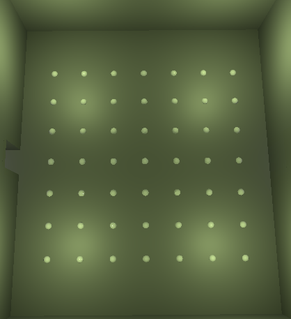
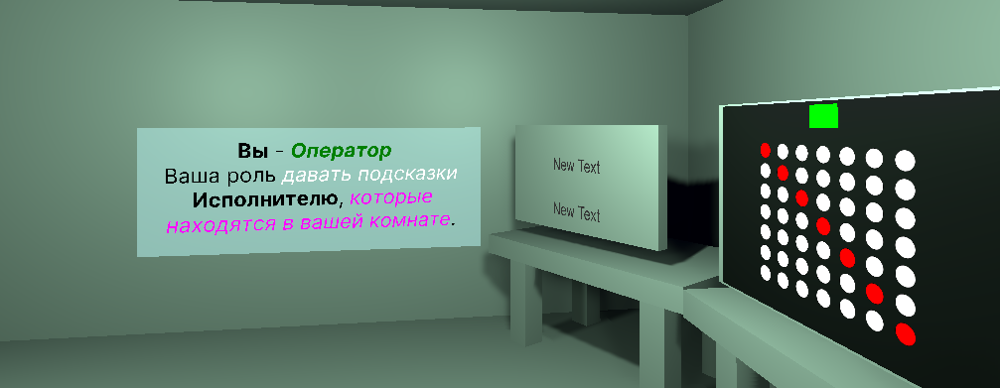
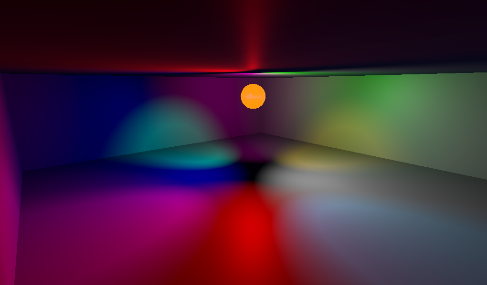

# RTUITLAB

## О проекте

**Версия Unity:** 2022.3.51f LTS  
**Начальный пакет:** VR Multiplayer Template

### Описание проекта

Этот проект представляет собой VR-головоломку для двух игроков. Игроки создают лобби, выбирают роли и проходят несколько головоломок в стиле IT с элементами киберпанка.

### Геймплей

1. **Начальная комната**  
   - В начальной комнате есть меню для создания лобби.
   - После создания и подключения к лобби двух игроков необходимо выбрать роль.

2. **Роли**  
   - **Executor (Исполнитель):** выполняет команды, полученные от Оператора.
   - **Operator (Оператор):** даёт подсказки, используя информацию, находящуюся в его комнате.

3. **Головоломки**  
   - **Первая головоломка:** ввод определённого набора цифр.
   - **Вторая головоломка:** активация нужных узлов.
   - **Третья головоломка:** удаление заражённых файлов.
   - **Четвёртая головоломка:** зашифровка слова.

4. **Финал**  
   - В финальной комнате игроков ждёт сюрприз в виде дискотеки.

### Сеттинг

Проект выполнен в сеттинге IT.

### Особенности

- Есть голосовой чат.
- В комнате Оператора присутствует панда, разработанная Kosmasek. (Отдельный респект ему)

### Скриншоты

### Видео

Ссылка - https://vkvideo.ru/video329384717_456247931
